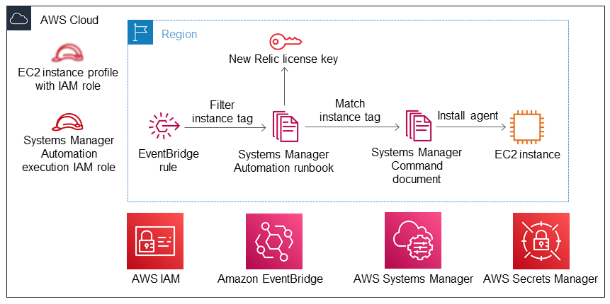

Deploying this Quick Start builds the following {partner-product-short-name} environment in the
AWS Cloud.

// Replace this example diagram with your own. Send us your source PowerPoint file. Be sure to follow our guidelines here : http://(we should include these points on our contributors giude)
:xrefstyle: short
[#architecture1]
.Quick Start architecture for {partner-product-short-name} on AWS

As shown in <<architecture1>>, the Quick Start sets up the following:

* (Optional) Amazon EC2 instance profile with a linked AWS Identity and Access Management (IAM) role used for granting access to AWS Systems Manager service functionality within the Amazon EC2 instance.*  
* An AWS Systems Manager Automation execution IAM role to allow the Amazon EC2 instances to run the AWS Systems Manager Automation runbook.
* In the Region:

** An Amazon EventBridge rule to filter the Amazon EC2 instances that have a designated tag to trigger the installation of the New Relic infrastructure agent on those instances. 
** An AWS Systems Manager Automation runbook with instructions for installing the New Relic infrastructure agent on Amazon EC2 instances with matching tags. The New Relic license key is entered here. 
** An AWS Systems Manager Command document to run the installation commands listed in the Automation runbook. 

* IAM configurations that include groups, roles, and instance profiles as well as customizable IAM policies.
* Amazon Eventbridge for providing the filtering rule.
* AWS Systems Manager for providing the Automation runbook and Command document.
* AWS Secrets Manager for storing the New Relic license key. 

[.small]#*The template prompts you for your {partner-product-short-name} license key and asks whether you want to create a new Systems Manager instance profile for your EC2 instances.#
