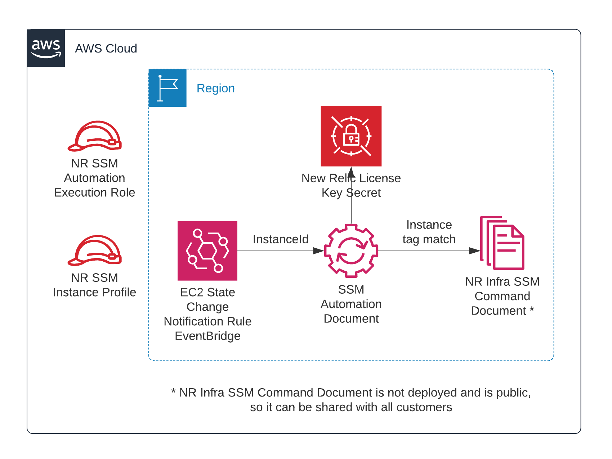

Deploying this Quick Start builds the following {partner-product-short-name} environment in the
AWS Cloud.

// Replace this example diagram with your own. Send us your source PowerPoint file. Be sure to follow our guidelines here : http://(we should include these points on our contributors giude)
:xrefstyle: short
[#architecture1]
.Quick Start architecture for {partner-product-short-name} on AWS

As shown in <<architecture1>>, the Quick Start sets up the following:

* EC2 instance profile and a linked IAM role if you choose to create a new instance profile when launching the template.
* SSM Automation execution IAM role.
* EventBridge rule.
* SSM Automation document.

[.small]#*The template skips the components marked by asterisks and prompts you for your New Relic License key and whether or not you want to create a new SSM instance profile for your EC2 instances.#
