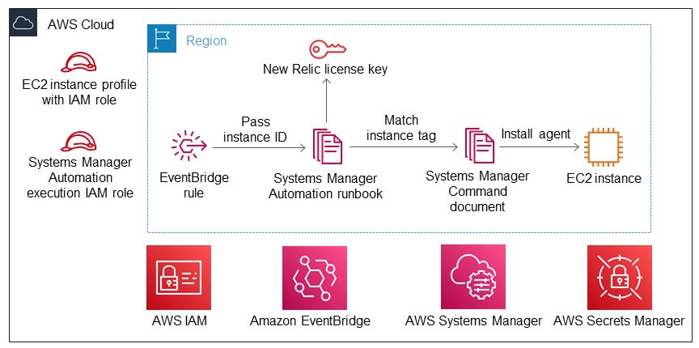

Deploying this Quick Start builds the following {partner-product-short-name} environment in the
AWS Cloud.

// Replace this example diagram with your own. Send us your source PowerPoint file. Be sure to follow our guidelines here : http://(we should include these points on our contributors giude)
:xrefstyle: short
[#architecture1]
.Quick Start architecture for {partner-product-short-name} on AWS

As shown in <<architecture1>>, the Quick Start sets up the following:

* (Optional) An Amazon Elastic Compute Cloud (Amazon EC2) instance profile with a linked AWS Identity and Access Management (IAM) role used for granting access to Systems Manager service functionality within the EC2 instance. You can attach this instance profile to existing EC2 instance and install the {partner-product-short-name} agent.*   
* Systems Manager Automation execution IAM role to allow running of the SSM document on the EC2 instances.
* EventBridge rule used to trigger the {partner-product-short-name} agent installation.
* SSM Automation document for installing the {partner-product-short-name} agent.
* Secrets manager used for storing the {partner-product-short-name} license key.

[.small]#*The template prompts you for your {partner-product-short-name} license key and asks whether you want to create a new Systems Manager instance profile for your EC2 instances.#
